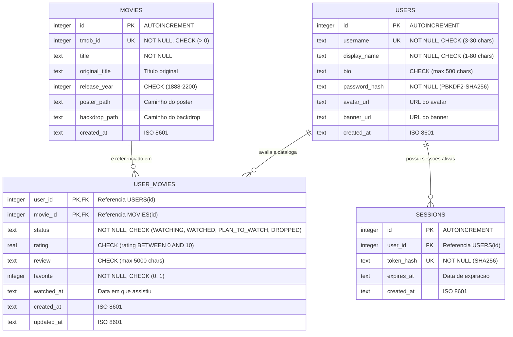

# 🎬 Cinefolio — Seu Perfil de Cinema

---

## 1. Identificação Institucional

| Campo | Informações do Grupo |
| :--- | :--- |
| **Instituição** | `[Nome da Instituição de Ensino]` |
| **Curso** | `[Nome do Curso / Ex: Ciência da Computação / ADS]` |
| **Disciplina** | Banco de Dados — Avaliação NP1 |
| **Professor(a)** | `[Nome do Professor]` |
| **Turma / Semestre** | `[Turma / Semestre Letivo]` |
| **Integrantes (Nome Completo & RA)** | • `[Nome do Integrante 1]` — RA: `[0000000]`<br>• `[Nome do Integrante 2]` — RA: `[0000000]`<br>• `[Nome do Integrante 3]` — RA: `[0000000]`<br>• `[Nome do Integrante 4]` — RA: `[0000000]` |

---

## 2. Descrição do Projeto e Regras de Negócio

### 2.1. Apresentação do Tema
O **Cinefolio** é uma plataforma web para cinéfilos e entusiastas do cinema registrarem, organizarem e compartilharem suas coleções de filmes assistidos, favoritos e listas de interesse ("pretendo assistir"). Cada usuário cadastrado possui uma página pública de perfil (`profile.html?user=nome_do_usuario`) com métricas agregadas (total de filmes assistidos, média pessoal de notas e número de reviews cadastrados).

### 2.2. Integração com a TMDB
O catálogo de filmes é alimentado em tempo real pela API da **The Movie Database (TMDB)**. Por segurança e estrita adesão arquitetural:
- O navegador consome **exclusivamente** os endpoints locais `/api/*` do próprio Cinefolio.
- O token da API TMDB permanece protegido no arquivo `.env` do servidor Python e **nunca** é enviado ao frontend.
- Os metadados dos filmes (título, sinopse, poster, ano) são persistidos no banco de dados SQLite local apenas quando um usuário os cataloga ou salva em seu perfil.

### 2.3. Regras de Negócio
1. **Unicidade de Usuário:** O `username` deve ser único no sistema, alfanumérico (com sublinhado `_`) e com 3 a 30 caracteres.
2. **Cardinalidade N:M e Chave Composta:** A relação entre usuário e filme é modelada na tabela associativa `user_movies`, com chave primária composta `PRIMARY KEY (user_id, movie_id)` e integridade referencial com `ON DELETE CASCADE`.
3. **Status Permitidos:** Um filme no perfil do usuário só pode assumir um dos seguintes status:
   - `WATCHING` (Assistindo)
   - `WATCHED` (Assistido)
   - `PLAN_TO_WATCH` (Pretendo Assistir)
   - `DROPPED` (Abandonado)
4. **Avaliação e Críticas:**
   - A nota é opcional, restrita ao intervalo de `0.0` a `10.0`.
   - A crítica textual (review) possui limite de 5.000 caracteres.
   - O status de favorito é representado por valor booleano (`0` ou `1`).
5. **Autenticação Segura:**
   - Senhas são criptografadas com `PBKDF2-HMAC-SHA256`, utilizando salt aleatório individual de 16 bytes e 310.000 iterações.
   - A sessão é gerida por token criptográfico de 256 bits (`secrets.token_urlsafe(32)`), armazenado com hash SHA-256 no banco e enviado via cookie `HttpOnly`, `SameSite=Lax` com validade de 7 dias.

---

## 3. Aderência às Restrições Acadêmicas

| Requisito | Status | Implementação no Projeto |
| :--- | :---: | :--- |
| **SGBD Relacional** | ✅ | **SQLite 3** com integridade referencial ativa (`PRAGMA foreign_keys = ON;`), chaves primárias, estrangeiras e constraints `CHECK`. |
| **Ausência de Frameworks no Backend** | ✅ | Implementado em **Python puro** utilizando apenas a biblioteca padrão (`http.server`, `sqlite3`, `urllib`, `hashlib`, `hmac`, `secrets`, `json`). Sem Django, Flask, FastAPI, NestJS ou ORMs (SQL direto parametrizado). |
| **Frontend Web Padrão** | ✅ | Desenvolvido em **HTML5 Semântico**, **CSS3 Customizado**, **JavaScript Puro (Vanilla JS)** e **Bootstrap 5.3** para grid responsivo. Sem React, Vue, Angular ou Next.js. |
| **Operações CRUD Completas** | ✅ | **Create:** Cadastro de usuários e adição de filmes ao perfil.<br>**Read:** Busca de filmes, detalhes e perfis públicos.<br>**Update:** Atualização de status/notas/reviews e dados de perfil.<br>**Delete:** Remoção de filme do perfil e exclusão definitiva de conta. |

---

## 4. Modelagem de Dados (DER & DDL)

### 4.1. Diagrama Entidade-Relacionamento (DER)



### 4.2. Estrutura DDL Completa ([`server/schema.sql`](server/schema.sql))
O esquema SQL completo inclui criação de tabelas, restrições de integridade, remoção em cascata e índices para otimização:
- `idx_user_movies_status`: Acelera a filtragem por status no perfil.
- `idx_user_movies_favorite`: Otimiza a recuperação da seção de favoritos.
- `idx_user_movies_watched_at`: Otimiza a ordenação cronológica de filmes assistidos.
- `idx_sessions_token`: Otimiza a validação de sessão por token hash.

---

## 5. Arquitetura do Software

A estrutura do código-fonte foi organizada em camadas claras e com responsabilidades bem delimitadas:

```text
cinefolio/
├── .env.example              # Exemplo de variáveis de ambiente
├── README.md                 # Documentação técnica e institucional
├── cinefolio.sqlite3         # Banco de dados SQLite local (gerado na 1ª execução)
├── public/                   # Frontend estático (HTML, CSS, JS)
│   ├── index.html            # Página inicial e catálogo/busca de filmes
│   ├── login.html            # Tela de autenticação
│   ├── register.html         # Tela de cadastro de novos usuários
│   ├── movie.html            # Detalhes do filme e formulário de classificação
│   ├── profile.html          # Perfil público com métricas e seções
│   ├── settings.html         # Painel de configurações do usuário
│   ├── assets/               # Imagens e vetores SVG padrão (avatar, banner)
│   ├── css/
│   │   └── app.css           # Estilização completa e temas em Dark Mode
│   └── js/
│       ├── api.js            # Cliente HTTP fetch e utilitários globais
│       ├── auth.js           # Gerenciamento de login e cadastro
│       ├── nav.js            # Controle da barra de navegação e sessão
│       ├── movie.js          # Interações da tela de detalhes e CRUD
│       ├── profile.js        # Renderização do perfil e diálogo de reviews
│       ├── search.js         # Busca reativa e destaques populares
│       └── settings.js       # Edição de perfil e exclusão de conta
└── server/                   # Backend em Python nativo
    ├── main.py               # Servidor HTTP multithread e dispatcher
    ├── router.py             # Roteador HTTP, parsing e tratamento de erros
    ├── schema.sql            # Script DDL do banco de dados
    ├── database/
    │   └── connection.py     # Gerenciamento de conexões SQLite nativas
    ├── controllers/          # Controladores HTTP desacoplados
    │   ├── auth_controller.py
    │   ├── movie_controller.py
    │   └── profile_controller.py
    ├── services/             # Regras de negócio e integrações
    │   ├── auth_service.py
    │   ├── profile_service.py
    │   └── tmdb_service.py
    ├── repositories/         # Camada de persistência (SQL nativo parametrizado)
    │   ├── user_repository.py
    │   ├── movie_repository.py
    │   └── user_movie_repository.py
    └── tests/                # Testes unitários automatizados
        ├── test_core.py      # Testes de banco, hashing, auth e regras de negócio
        └── test_tmdb.py      # Testes de catálogo e isolamento da API TMDB
```

---

## 6. Mapeamento de Rotas da API REST

| Método | Rota | Descrição | Autenticação |
| :--- | :--- | :--- | :---: |
| `POST` | `/api/auth/register` | Cria uma nova conta de usuário | Pública |
| `POST` | `/api/auth/login` | Realiza login e emite cookie de sessão | Pública |
| `POST` | `/api/auth/logout` | Encerra a sessão ativa e expira o cookie | Pública |
| `GET` | `/api/auth/me` | Retorna os dados do usuário autenticado | Obrigatória |
| `GET` | `/api/movies/search?q={termo}` | Busca filmes por título na TMDB | Pública |
| `GET` | `/api/movies/popular` | Lista filmes em destaque na semana | Pública |
| `GET` | `/api/movies/{tmdb_id}` | Obtém detalhes completos do filme | Pública |
| `PUT` | `/api/movies/{tmdb_id}/profile` | Salva/atualiza filme no perfil do usuário | Obrigatória |
| `DELETE`| `/api/movies/{tmdb_id}/profile` | Remove o filme do perfil do usuário | Obrigatória |
| `GET` | `/api/profiles/{username}` | Retorna o perfil público com estatísticas | Pública |
| `PUT` | `/api/profile` | Atualiza biografia, fotos e nome de exibição | Obrigatória |
| `DELETE`| `/api/account` | Exclui a conta e dados do usuário em cascata | Obrigatória |

---

## 7. Guia de Instalação e Execução

### 7.1. Pré-requisitos
- **Python 3.10** ou superior instalado.
- Chave/Token de leitura da API TMDB (gratuita em [themoviedb.org](https://www.themoviedb.org/)).

### 7.2. Passo a Passo de Configuração

1. **Clonar o Repositório:**
   ```bash
   git clone https://github.com/odiegoalessandro/cinefolio.git
   cd cinefolio
   ```

2. **Configurar as Variáveis de Ambiente:**
   Copie o arquivo `.env.example` para `.env`:
   ```bash
   # No Linux / macOS:
   cp .env.example .env

   # No Windows (PowerShell):
   Copy-Item .env.example .env
   ```

   Abra o arquivo `.env` e insira o seu token da TMDB:
   ```env
   TMDB_BEARER_TOKEN=seu_token_aqui
   HOST=127.0.0.1
   PORT=8000
   ```

3. **Iniciar a Aplicação:**
   ```bash
   python -m server.main
   ```

4. **Acessar no Navegador:**
   Abra no seu navegador o endereço:
   ```text
   http://127.0.0.1:8000
   ```

> ⚠️ **Importante:** Não abra os arquivos `.html` diretamente com dois cliques nem utilize extensões como o *Live Server*, pois a autenticação, persistência SQLite e consulta à TMDB necessitam do backend Python ativo.

---

## 8. Execução dos Testes Automatizados

A suíte de testes unitários valida o esquema do banco, operações de CRUD, integridade referencial, hashing com salt e integração simulada (mocks):

```bash
# Validação de sintaxe e compilação
python -m compileall server

# Execução de todos os testes unitários
python -m unittest discover -s server/tests -v
```

---

## 9. Evidências Visuais e Roteiro de Demonstração (Peer Review)

Para a dinâmica de avaliação por pares (**Peer Review**), recomenda-se seguir o seguinte fluxo:
1. **Cadastro (`/register.html`):** Crie uma conta informando username, nome e senha com 8+ caracteres.
2. **Login (`/login.html`):** Autentique-se com a conta recém-criada.
3. **Catálogo & Busca (`/index.html`):** Visualize os filmes populares ou digite o nome de um filme na barra de pesquisa.
4. **Classificação & CRUD (`/movie.html?id=...`):**
   - Acesse um filme, marque status como `Assistido`, atribua uma nota (ex: `9.5`), selecione data e escreva um review.
   - Marque a opção `Favorito` e clique em `Salvar no Perfil`.
5. **Perfil Público (`/profile.html?user=...`):**
   - Acesse o perfil e visualize os contadores atualizados (assistidos, média de notas, reviews).
   - Localize o filme na seção de `Favoritos` e clique em `Ler Review` para testar o modal interativo.
6. **Configurações (`/settings.html`):**
   - Altere a bio e insira URLs personalizadas de avatar e banner.
   - Salve e confira o visual atualizado no perfil público.
