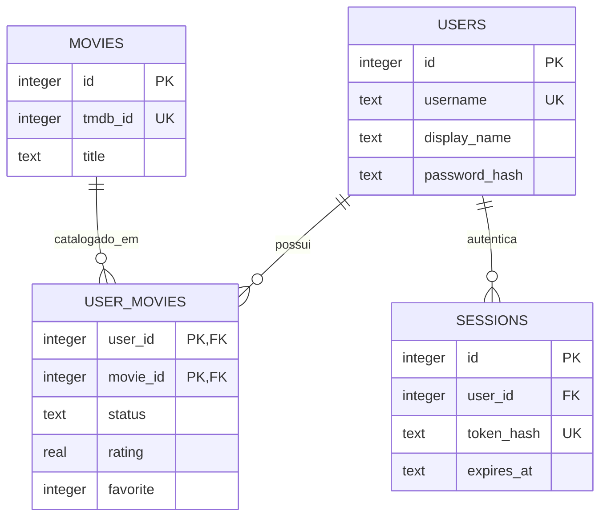

# Cinefolio

## Identificação institucional

| Campo | Preencher |
| --- | --- |
| Aluno(a) | `[SEU NOME]` |
| Matrícula | `[SUA MATRÍCULA]` |
| Disciplina | `[BANCO DE DADOS]` |
| Professor(a) | `[NOME DO PROFESSOR]` |
| Instituição | `[NOME DA INSTITUIÇÃO]` |
| Turma/Semestre | `[TURMA/SEMESTRE]` |

## Sobre o projeto

Cinefolio é uma plataforma pessoal de filmes. Cada pessoa cria uma conta, mantém sua coleção de filmes e publica um perfil acessível por `profile.html?user=nome_do_usuario`. Um filme pode receber estado, nota, review, favorito e data em que foi assistido.

O catálogo vem da TMDB, mas somente o backend conversa com a API externa. O navegador consome apenas as rotas `/api/*` do próprio Cinefolio; o token da TMDB fica no arquivo `.env` local e não é enviado ao JavaScript nem retornado por endpoints.

## Como funciona

- **Frontend:** páginas HTML, CSS e JavaScript puro em `public/`.
- **Backend:** servidor HTTP em Python padrão, iniciado por `python3 -m server.main`.
- **Banco de dados:** SQLite em `cinefolio.sqlite3`, criado automaticamente na primeira execução.
- **Autenticação:** senhas usam PBKDF2-HMAC-SHA256 com salt individual. Sessões são persistidas no SQLite por até sete dias e enviadas em cookie `HttpOnly` e `SameSite=Lax`.
- **Catálogo TMDB:** busca, filmes populares e detalhes passam pelo backend. Metadados de filmes entram no SQLite apenas quando o usuário os salva no perfil.
- **Imagens de perfil:** se avatar ou banner não forem configurados, o frontend mostra imagens SVG padrão locais. O usuário pode definir suas próprias URLs em configurações.

## Regras de negócio

- Cada `username` é único.
- Um usuário tem somente um registro por filme (`PRIMARY KEY (user_id, movie_id)`).
- Estados aceitos: `WATCHING`, `WATCHED`, `PLAN_TO_WATCH` e `DROPPED`.
- Nota é opcional e limitada a 0–10; favorito é `0` ou `1`.
- Somente o dono autenticado pode editar perfil, seus filmes e sua conta.
- O perfil público não expõe hash de senha ou dados de sessão.

## Tecnologias e conformidade acadêmica

- **Banco:** SQLite com DDL explícito em `server/schema.sql`.
- **Acesso a dados:** `sqlite3`, SQL manual parametrizado e sem ORM.
- **Backend:** Python padrão (`http.server`, `urllib`, `json`, `hashlib`, `secrets`) e leitura nativa do arquivo `.env`, sem dependências externas de Python.
- **Frontend:** HTML5, CSS3 e JavaScript puro. Sem React, Vue, Angular ou Tailwind.

## Instalação e configuração

### 1. Pré-requisitos

- Python 3.10 ou superior.
- Um token de leitura da API TMDB.

### 2. Configure o arquivo `.env`

Copie o modelo fornecido:

```bash
cp .env.example .env
```

Abra `.env` e preencha o token:

```env
TMDB_BEARER_TOKEN=seu_token_de_leitura_da_tmdb
HOST=127.0.0.1
PORT=8000
```

`HOST` e `PORT` são opcionais. Se não forem informados, o servidor usa `127.0.0.1:8000`.

O `.env` é carregado automaticamente quando o servidor inicia. Ele está ignorado pelo Git e deve permanecer local: não publique o token no repositório.

### 3. Inicie a aplicação

```bash
python3 -m server.main
```

Abra no navegador:

```text
http://127.0.0.1:8000/
```

Não abra `public/index.html` diretamente nem use Live Server: login, banco de dados e TMDB exigem o servidor Python do projeto.

### Páginas disponíveis

- Inicial e busca: `/`
- Login: `/login.html`
- Cadastro: `/register.html`
- Perfil público: `/profile.html?user=nome_do_usuario`
- Configurações: `/settings.html`

## Banco de dados

O arquivo `cinefolio.sqlite3` aparece automaticamente na raiz ao iniciar o servidor pela primeira vez. Ele contém contas, filmes salvos, relações usuário-filme e sessões.

Para recomeçar os dados locais, pare o servidor e remova somente `cinefolio.sqlite3`. Essa ação apaga as contas, sessões e filmes locais.

## Modelo entidade-relacionamento



O DDL completo, com chaves estrangeiras, `CHECK`, índices e chaves primárias, está em [`server/schema.sql`](server/schema.sql).

## Endpoints principais

- `POST /api/auth/register`
- `POST /api/auth/login`
- `POST /api/auth/logout`
- `GET /api/auth/me`
- `GET /api/movies/search`
- `GET /api/movies/popular`
- `GET /api/movies/{tmdb_id}`
- `PUT` / `DELETE /api/movies/{tmdb_id}/profile`
- `GET /api/profiles/{username}`
- `PUT /api/profile`
- `DELETE /api/account`

## Testes

A suíte usa somente `unittest` e mocks: não inicia servidor HTTP, não abre browser, não usa `curl` e não consulta a TMDB real.

```bash
python3 -m compileall server
python3 -m unittest discover -s server/tests -v
```

## Escopo

Incluído: cadastro, login/logout, edição de perfil, busca e detalhes TMDB pelo backend, CRUD de filmes, perfil público, notas, reviews e estatísticas.

Fora do MVP: seguidores, feed, comentários entre usuários, mensagens, recomendações, OAuth, microserviços e WebSockets.
