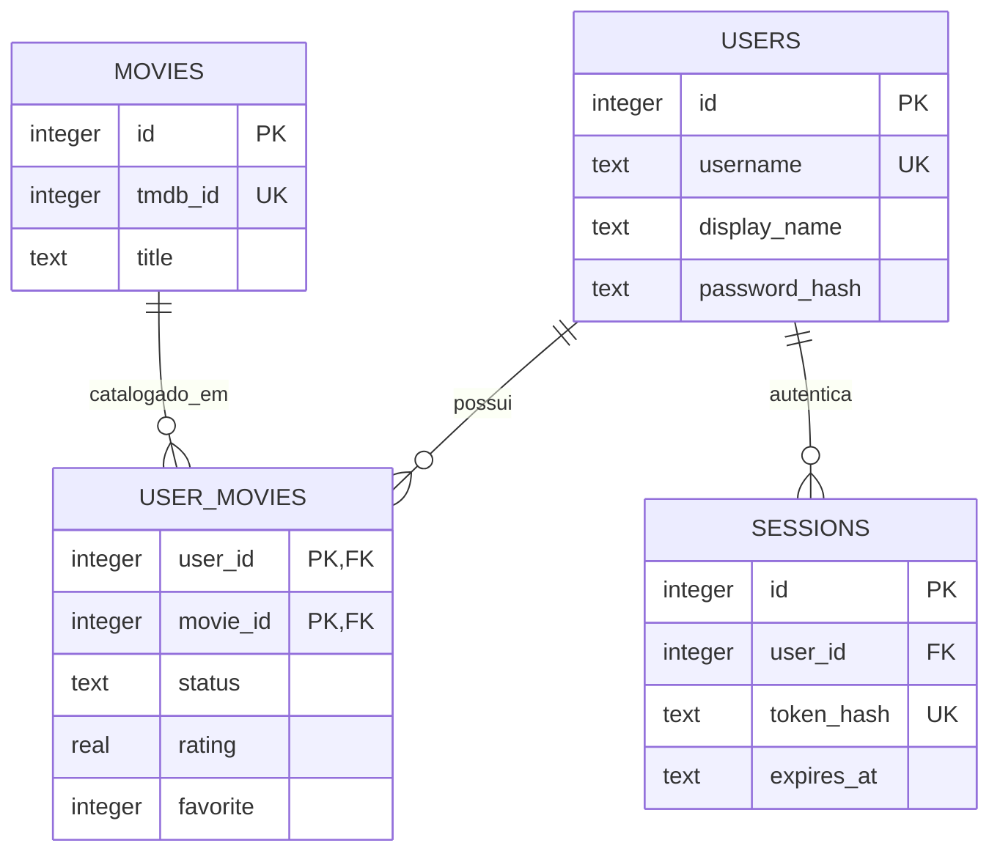

# Cinefolio

## Identificação institucional

| Campo | Preencher |
| --- | --- |
| Aluno(a) | `[SEU NOME]` |
| Matrícula | `[SUA MATRÍCULA]` |
| Disciplina | `[BANCO DE DADOS]` |
| Professor(a) | `[NOME DO PROFESSOR]` |
| Instituição | `[NOME DA INSTITUIÇÃO]` |
| Turma/Semestre | `[TURMA/SEMESTRE]` |

## Sobre

Cinefolio é uma plataforma de perfil pessoal focada em cinema. Usuários cadastram filmes com estado, nota, review, favorito e data assistida; a página pública organiza esses dados como uma coleção visual. A TMDB fornece somente metadados de catálogo através do backend. O SQLite permanece como fonte de verdade para contas, relações usuário-filme e sessões.

## Regras de negócio

- Cada `username` é único.
- Senhas não são armazenadas em texto puro: PBKDF2-HMAC-SHA256 com salt individual.
- Um usuário pode ter apenas um registro por filme (`PRIMARY KEY (user_id, movie_id)`).
- Estados permitidos: `WATCHING`, `WATCHED`, `PLAN_TO_WATCH` e `DROPPED`.
- Nota é opcional e limitada a 0–10; favorito é 0 ou 1.
- Filmes entram em `movies` somente ao serem salvos no perfil.
- Somente o dono autenticado edita perfil, relação com filme ou conta.
- Sessões são persistidas em SQLite, expiram em sete dias e são enviadas exclusivamente em cookie `HttpOnly`/`SameSite=Lax`.

## Escopo

Incluído: cadastro, login/logout, edição de perfil, busca e detalhes TMDB pelo backend, CRUD de filmes do usuário, perfil público e estatísticas.

Fora do MVP: seguidores, feed, comentários, mensagens, recomendações, OAuth, microserviços e WebSockets.

## Tecnologias e conformidade acadêmica

- **Banco:** SQLite com DDL explícito em `server/database/schema.sql`.
- **Acesso a dados:** `sqlite3`, SQL manual parametrizado e sem ORM.
- **Backend:** Python padrão (`http.server`, `urllib`, `json`, `hashlib`, `secrets`). Sem Flask/FastAPI/Django.
- **Frontend:** HTML5, CSS3, JavaScript puro e Bootstrap CDN. Sem React/Vue/Angular/Tailwind.

## Modelo entidade-relacionamento



O DDL completo, incluindo FKs, `CHECK`, PKs e índices, está em [`server/database/schema.sql`](server/database/schema.sql).

## Instalação e execução

Requisito: Python 3.10+ (nenhum pacote precisa ser instalado).

```bash
cp .env.example .env
# Configure TMDB_BEARER_TOKEN no ambiente/shell, sem enviar .env ao Git.
export TMDB_BEARER_TOKEN="seu_token"
python3 -m server.main
```

O arquivo `cinefolio.sqlite3` é criado automaticamente na raiz na primeira execução. Para reiniciar os dados localmente, remova apenas esse arquivo com o servidor parado.

## TMDB

Defina `TMDB_BEARER_TOKEN` somente no ambiente do servidor. O browser chama `/api/movies/*`; somente `server/services/tmdb_service.py` acessa `api.themoviedb.org`. A chave nunca é enviada ao JavaScript ou às respostas API.

## CRUD demonstrado

| Operação | Fluxo/API | SQL local |
| --- | --- | --- |
| Create | cadastro; salvar filme/review | `INSERT INTO users`, `movies`, `user_movies` |
| Read | login; perfil público; lista pessoal | `SELECT` com `JOIN` |
| Update | editar perfil, status, nota, review, favorito | `UPDATE`; upsert SQL em `user_movies` |
| Delete | remover filme; excluir conta | `DELETE`; FKs em cascata |

Endpoints: `POST /api/auth/register`, `POST /api/auth/login`, `POST /api/auth/logout`, `GET /api/auth/me`, `GET /api/movies/search`, `GET /api/movies/popular`, `GET /api/movies/{tmdb_id}`, `PUT`/`DELETE /api/movies/{tmdb_id}/profile`, `GET /api/profiles/{username}`, `PUT /api/profile`, `DELETE /api/account`.

## Testes unitários

A validação automatizada usa exclusivamente `unittest` e `unittest.mock`, sem servidor HTTP, browser, `curl`, TMDB real ou testes de integração:

```bash
python3 -m compileall server
python3 -m unittest discover -s tests -v
```

Os testes cobrem schema SQLite, constraints, repositórios, hash/sessões, regras de perfil, respostas TMDB mockadas e erros de validação.

## Screenshots

Após iniciar a aplicação e configurar a TMDB, adicione imagens em `public/assets/screenshots/` e as referencie aqui. Capturas sugeridas: home/pesquisa, detalhe com formulário, perfil público e configurações. As screenshots não são incluídas para evitar documentar uma interface não executada no ambiente de desenvolvimento.
